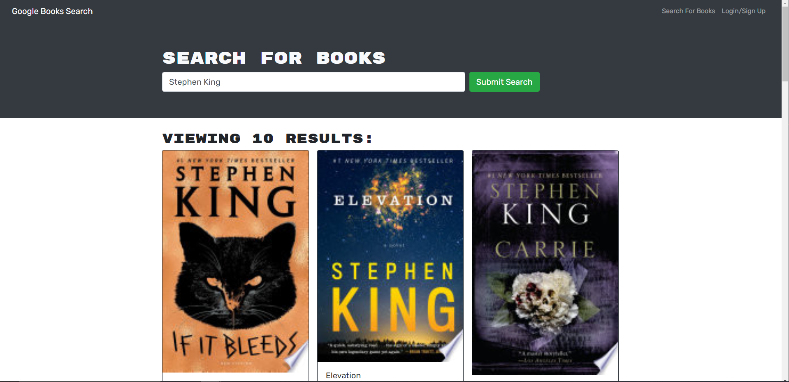
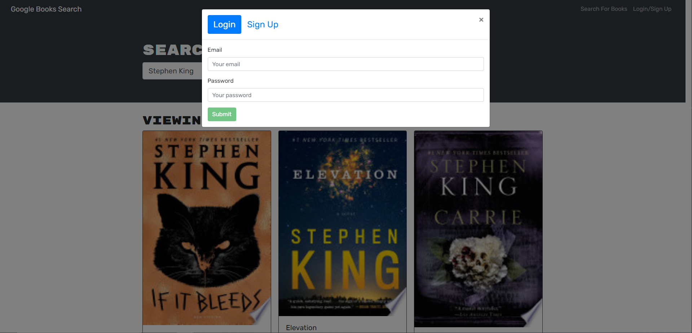
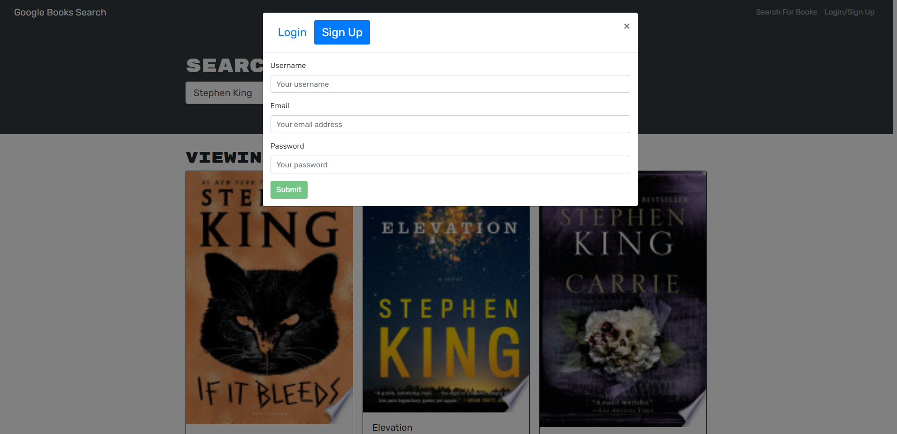

# Book Search Engine

Link to deployed site [here](https://mern-booksearch-app.herokuapp.com/)

## Table of Contents:
  * [Description](#description)
  * [Technologies Used](#technologiesUsed)
  * [Screenshots](#screenshots)
  * [Credits](#credits)
  * [Email](#email)
  * [GitHub](#github)

## Description

This project was to refactor a RESTful API into a GraphQL API built with an Apollo Server. It allows users to search and save books from their favorite authors

## Technologies Used:
    HTML5
    CSS
    React.js
    GraphQL
    Apollo Server
    Restful API

## Screenshots:

## Application Link
[https://sskolbo-book-mark.herokuapp.com/](https://sskolbo-book-mark.herokuapp.com/)

## Credits
Created By: Stephen Kolbo.

## Email
Have any questions? feel free to email me at sskolbo88@yahoo.com. 

## GitHub
Follow me on github where you can also ask me questions here at https://github.com/skolbo.
